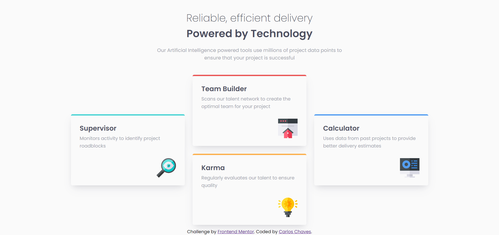

# Frontend Mentor - Four card feature section solution

This is a solution to the [Four card feature section challenge on Frontend Mentor](https://www.frontendmentor.io/challenges/four-card-feature-section-weK1eFYK). Frontend Mentor challenges help you improve your coding skills by building realistic projects. 

## Table of contents

- [Overview](#overview)
  - [Screenshot](#screenshot)
  - [Links](#links)
- [My process](#my-process)
  - [Built with](#built-with)
  - [Continued development](#continued-development)
- [Author](#author)

## Overview

### The challenge

Users should be able to:

- View the optimal layout for the site depending on their device's screen size

### Screenshot

### Links

- Solution URL: [https://www.frontendmentor.io/challenges/four-card-feature-section-weK1eFYK/hub?share=true](https://www.frontendmentor.io/challenges/four-card-feature-section-weK1eFYK/hub?share=true)
- Live Site URL: [https://sircarloschaves.github.io/four-card-feature-section/](https://sircarloschaves.github.io/four-card-feature-section/)

## My process

### Built with

- Semantic HTML5 markup
- CSS custom properties
- Flexbox
- CSS Grid
- Mobile-first workflow

### Continued development

I want to continue improving with more complex layouts.

## Author

- Website - [Carlos Chaves](https://github.com/sircarloschaves)
- Twitter - [@carloschavesdev](https://twitter.com/carloschavesdev)
